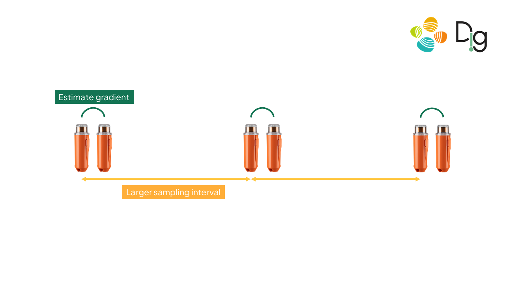

Reproducible material for Multichannel wavefield reconstruction of land seismic data with stencil-based spatial gradients -
Khatami, MI and Ravasi, M. - 86th EAGE Annual Conference & Exhibition


## Project structure
This repository is organized as follows:


* :open_file_folder: **data**: folder containing the instruction on how to retrieve the data
* :open_file_folder: **figures**: folder containing the image/figures produced from the experiments
* :open_file_folder: **landmc**: a set of package to do multichannel wavefield reconstruction of land seismic data
* :open_file_folder: **notebooks**: set of jupyter notebooks reproducing the experiments in the paper (see below for more details);

You can download the required dataset from the following link: https://drive.google.com/drive/folders/1F3dB9LmiSiUvK-RuncXfWxbOlHKc5Ijj?usp=sharing

After downloading, place the contents into the **data/** folder of this repository.

## Notebooks
The following notebooks are provided:
- :orange_book: ``1. Data Preparation-Synthetic Data.ipynb``: notebook performing the preprocessing of the synthetic data;
- :orange_book: ``2. LandMCReconstruction-Synthetic Data.ipynb``: notebook performing wavefield reconstruction of synthetic data;
- :orange_book: ``3. Data Preparation-Field Data.ipynb``: notebook performing the preprocessing of the field data;
- :orange_book: ``4. LandMCReconstruction-Field Data.ipynb``: notebook performing wavefield reconstruction of field data;


## Getting started :space_invader: :robot:
To ensure reproducibility of the results, we suggest using the `environment.yml` file when creating an environment.

Simply run:
```
./install_env.sh
```
It will take some time, if at the end you see the word `Done!` on your terminal you are ready to go. After that you can simply install your package:
```
pip install .
```
or in developer mode:
```
pip install -e .
```

Remember to always activate the environment by typing:
```
conda activate landmc
```
